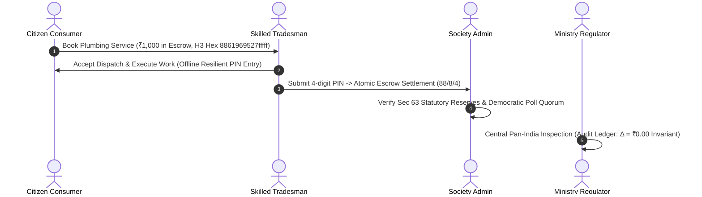

# SahakarConnect (सहकार कनेक्ट)
## Hackathon Pitch & Audited Judge Click-Path (180-Second Evaluation Walkthrough)

> **Statutory Multi-State Primary Service Cooperative Society (PSCS) Platform**  
> Formatted strictly under the **Multi-State Co-operative Societies (MSCS) Act, 2023** & **MeitY UX4G Design System (GIGW 3.0)**.

---

### Executive Pitch Thesis (15 Seconds)
> *"Current gig platforms extract 25% to 35% predatory commissions from blue-collar tradesmen with zero social security and zero transparency.  
> **SahakarConnect** restructures home services into democratic, worker-owned Primary Service Cooperative Societies.  
> We guarantee an immutable **88% worker take-home**, **8% cooperative welfare pool**, and **4% platform opex**, backed by an ACID-compliant, zero-rounding-leakage tripartite ledger and full Ministry of Cooperation oversight."*

---

### Demo Persona Credentials Matrix

| Persona Role | Demo Login Email | Password | Assigned Tenant / Jurisdiction |
| :--- | :--- | :--- | :--- |
| **Citizen Consumer** | `vikram.consumer@gmail.com` | `Password@123` | South Delhi Urban District |
| **Skilled Tradesman** | `ramesh.plumber@sahakar.org` | `Password@123` | South Delhi Urban Tradesmen PSCS |
| **Society Admin** | `admin.delhi@sahakar.gov.in` | `Password@123` | South Delhi Urban Tradesmen PSCS |
| **Central Regulator** | `regulator@cooperation.gov.in` | `Password@123` | Ministry of Cooperation, GoI (CRCS) |

---

### Timed 180-Second Evaluation Walkthrough

---

### Step 1: Citizen Consumer Booking & Spatial Dispatch (0:00 – 0:35)
**URL:** `http://localhost:5173`

1. **Open the Citizen Consumer Portal:**
   - Click **Citizen Consumer** (Vikram Malhotra).
   - Show the **UX4G Accessible Interface**: Toggle Light/Dark/Contrast mode and font scaling (`A-`, `A`, `A+`) to demonstrate full **GIGW 3.0 / WCAG 2.1 AA** compliance.
2. **Select Service from Catalog:**
   - Choose **Plumbing & Sanitary Works** → Click **"Book Verified Tradesman"** on *Drainage Unclogging & Jetting* (₹1,000 statutory cooperative rate).
3. **Dispatch & Spatial Match:**
   - Location automatically resolves to Hauz Khas, South Delhi (Uber H3 Index: `8861969527fffff`).
   - Confirm the booking.
   - Point out to judges:
     - **No surge pricing:** Rates are ratified democratically by society members.
     - **Escrow Lock:** ₹1,000 is securely locked in escrow with a tamper-proof 4-digit PIN generated for completion.

---

### Step 2: Skilled Tradesman & Offline Resilience (0:35 – 1:10)
**Switch Persona:** Click **Tradesman** button in top bar (`ramesh.plumber@sahakar.org`).

1. **View Real-Time Incoming Dispatch:**
   - Show the newly assigned booking under **Active Job Dispatch**.
   - Spatial proximity indicator confirms the tradesman is within the same H3 resolution-8 hex.
2. **Job Lifecycle Progression:**
   - Click **"Accept Dispatch"** → Status advances to `ACCEPTED`.
   - Click **"Start Job"** → Status advances to `IN_PROGRESS`.
3. **Demonstrate Offline Resilience (Basement / Elevator Test):**
   - *Judge Defense Point:* Tradesmen frequently work in basements or elevator shafts with zero cell connectivity.
   - Simulate offline mode: Toggle network off or click **"Complete Job"**.
   - Enter the 4-digit PIN:
     - Notice the **Offline Action Queue**: The completion PIN is safely buffered in the local encrypted queue.
     - Reconnecting triggers the background service worker, immediately syncing the PIN with the backend.
4. **Instant Worker Earnings & Welfare Credit:**
   - The ₹1,000 escrow is settled in an atomic database transaction.
   - Ramesh Kumar's wallet immediately reflects **₹880 (88%)** direct payout.
   - **₹80 (8%)** is deposited into the South Delhi Welfare Fund for medical & accident insurance.

---

### Step 3: Society Admin Hub & Democratic Governance (1:10 – 1:45)
**Switch Persona:** Click **Admin** button in top bar (`admin.delhi@sahakar.gov.in`).

1. **Tripartite Zero-Leakage Ledger:**
   - Open the **"Tripartite Ledger & Reserves"** tab.
   - Show the transaction row:
     - Gross: ₹1,000.00
     - Worker Payout: ₹880.00 (88%)
     - Welfare Pool: ₹80.00 (8%)
     - Platform Opex: ₹40.00 (4%)
     - **Mathematical Invariant:** $880 + 80 + 40 \equiv 1000$ (Exact penny balancing, zero rounding leakage).
2. **Statutory Reserve Verification (MSCS Act 2023 Sec 63):**
   - Point out the **Statutory Reserve Balance**: PSCS maintains over ₹25,000, easily exceeding the mandatory 15% statutory reserve ratio.
3. **Aadhaar e-KYC Verification Queue:**
   - Open **"Tradesmen e-KYC Queue"**: Show verified NSQF Level 4/5 certifications and police clearance records.
4. **Democratic Quorum & Member Polls:**
   - Open **"Democratic Governance & Quorum"** tab:
     - Active Poll: *"Increase Monsoon Welfare Fund Deduction from 8% to 10% for Group Health Insurance"*.
     - Show **One-Member One-Vote** principle with Class-A quorum tracking.

---

### Step 4: Central Regulator & Ministry of Cooperation Oversight (1:45 – 2:25)
**Switch Persona:** Click **Regulator** button in top bar (`regulator@cooperation.gov.in`).

1. **Central Ministry Authority Console:**
   - Show official heading: **Central Registrar of Cooperative Societies (CRCS)** under the **Multi-State Co-operative Societies Act, 2023**.
   - Review nationwide aggregate KPIs:
     - **4 Primary Societies** active across 3 States (Delhi, Maharashtra, Karnataka).
     - **15 NSQF-Certified Tradesmen**.
     - **₹74,600+ Gross Volume** disbursed with zero intermediary leakage.
     - **₹239,450+ Cumulative Welfare Reserves**.
     - **100% Statutory Compliance Rate**.
2. **Multi-State & District Rollup Filters:**
   - Filter by **"Maharashtra"**: Instantly scopes metrics to Pune District Shramik PSCS and Mumbai Suburban Labour PSCS.
   - Filter by **"Karnataka"**: Shows Bengaluru Urban Home Services Co-op Society.
3. **Nationwide Audit Ledger Inspector:**
   - Switch to **"Audit Ledger"** tab.
   - Every transaction displays the statutory badge: `Δ = ₹0.00` proving zero leakage.
   - Click **"Export Audit CSV"**: Generates a standard audit sheet ready for Central Registrar filing.

---

### Step 5: Technical Architecture & SIH Defense Highlights (2:25 – 3:00)

| Architectural Layer | Implementation Details |
| :--- | :--- |
| **Frontend** | React 18, TypeScript, Vite, MeitY UX4G Token System, Theme Toggle (Light / Dark / High-Contrast GIGW 3.0), Offline PWA Service Worker (Workbox). |
| **Backend** | Node.js, Express, TypeScript, Prisma ORM, PostgreSQL with ACID transaction isolation. |
| **Spatial Engine** | Uber H3 Hexagonal Discrete Global Grid System (Resolution-8 cells, ~460m precision). |
| **Real-Time Engine** | Redis Pub/Sub + Socket.io for sub-50ms dispatch notifications and live status updates. |
| **Statutory Ledger** | Tripartite zero-leakage accounting engine enforcing MSCS Act 2023 Sec 63 reserve ratios. |
| **Multi-Tenancy & RBAC**| Cooperative-scoped tenancy isolation with cryptographic JWT role verification. |
| **Test Coverage** | 26/26 Unit & Integration tests passing; 52/52 live assertion validations verified. |

---

### Quick Judge Q&A Defense Sheet

1. **Q: How does this prevent algorithmic discrimination common in private gig apps?**  
   *A:* Private platforms use proprietary black-box algorithms that throttle workers who reject low-paying gigs. In SahakarConnect, dispatch priority is governed strictly by open H3 spatial proximity, NSQF certification tier, and democratic society membership.

2. **Q: What happens if a tradesman enters a wrong completion PIN?**  
   *A:* Escrow settlement is locked behind an atomic database transaction. If the PIN doesn't match the consumer's OTP, the endpoint returns a `400 Bad Request`, preventing fraudulent payouts while keeping the escrow intact.

3. **Q: How does the system handle poor network coverage in basements?**  
   *A:* Our PWA offline resilience layer buffers worker status transitions and completion PINs in local storage. Once network connectivity is restored, the service worker flushes the queue sequentially, ensuring zero lost updates.

4. **Q: How does this comply with the Multi-State Co-operative Societies (MSCS) Act 2023?**  
   *A:* It enforces Section 63 statutory reserve ratios (minimum 15% transferred to reserves), Class-A voting quorum requirements, and grants the Central Registrar real-time read-only supervisory audit access.
